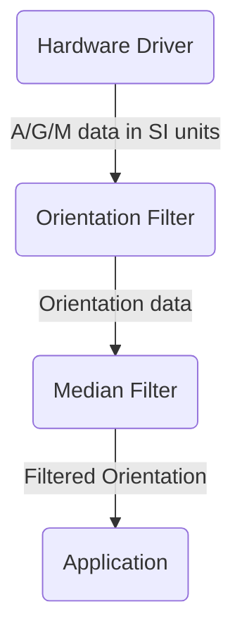
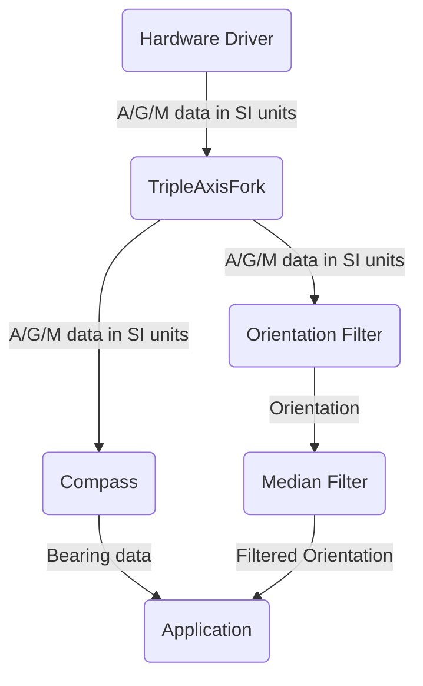
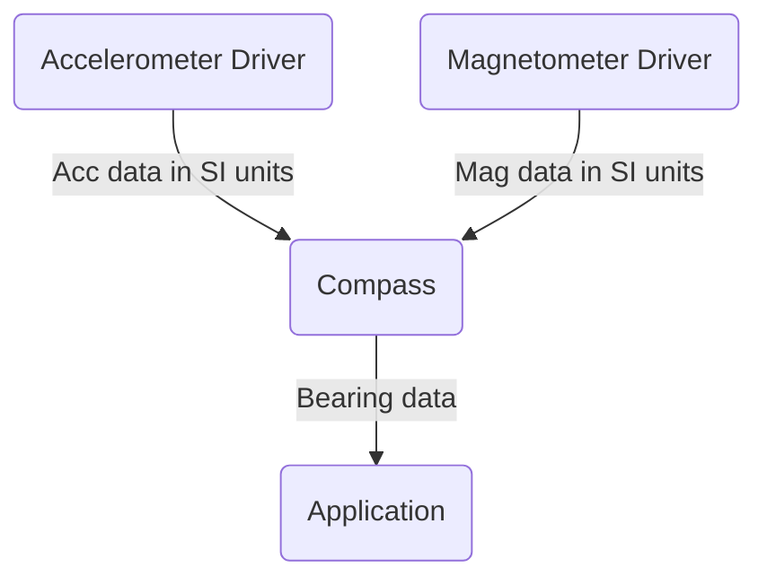
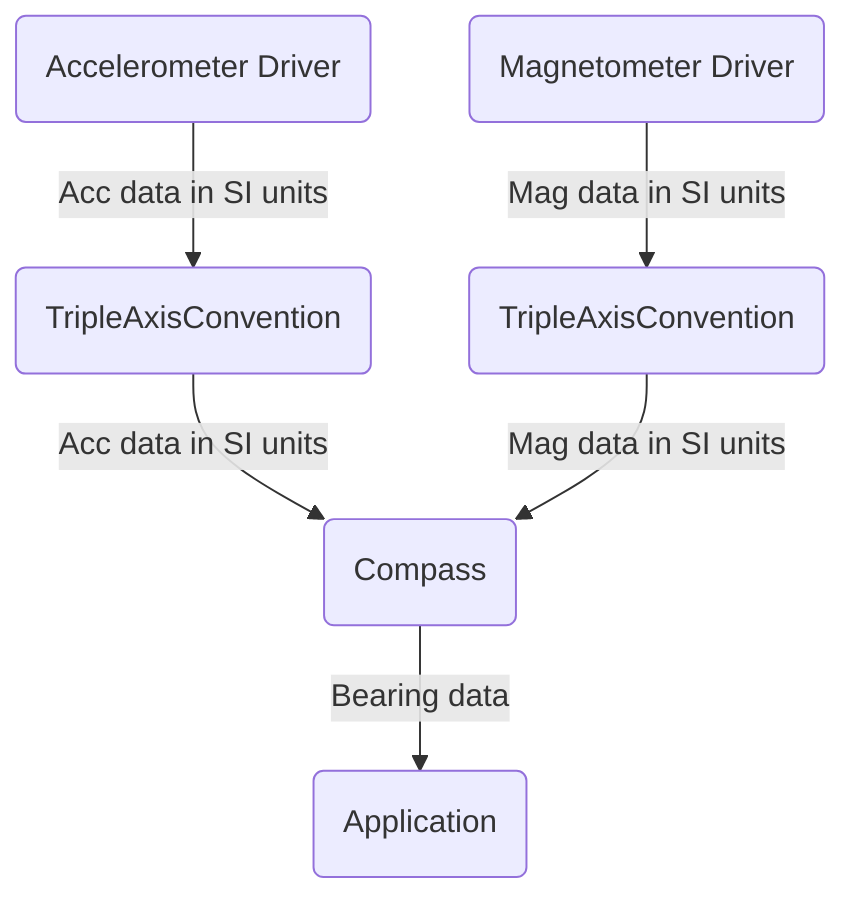

# TripleAxisPipe

An interchange interface and utility classes for exchange and processing of vector data.

## `#define`

* 'Efferent:' Moving away from a specified point-of-reference. That is: an output. Efferent "exits".
* 'Afferent:' Moving toward a specified point-of-reference. That is: an input. Afferent "arrives".
* 'Source:' A link in the pipeline that only has efferent connections. Generally, a sensor driver of some sort.
* 'Sink:' A link in the pipeline that only has afferent connections. Generally, the application itself.

## Common problems in 3-axis sensors

There are number of sensor modalities that return sophisticated data in three axes. Not only does this data typically share similar constraints and processing requirements, but it also relates to physical space and is used in the same kinds of pipelines.

The drivers for these sensors are organized as "feed-forward" [pipelines](https://en.wikipedia.org/wiki/Pipeline_(computing)), which means that data is emitted once from the source, and is processed in stages which may be parallel. Execution flow through the pipeline is rooted in the driver's intake function. This typically means the I/O callback or application-accessible `poll()` function.

Suppose we had a 9-DOF sensor (Mag, Gyro, Accelerometer), and our application needs orientation, with configurable filtering...

Pipelines are 1:1 with respect to their efferent connections to other nodes in the pipeline. But there is a special-case pipeline class called `TripleAxisFork`. The only purpose of this class is to bifurcate the data flow to different filters and processing functions.

Suppose we had a 9-DOF sensor (Mag, Gyro, Accelerometer), and our application needs a compass and orientation. That is: two separate pieces of information from the same root data. You might have a pipeline like this...

The data structure underlying pipeline assignments is an implicit single-linked list with the source of the data at the root. But afferent references to a given node may be replicated across data sources that feed that class. Thus, there is no need for a 2:1 afferent-to-efferent analog of this class.

Suppose we had a simple accelerometer, and a discrete magnetometer and our application is a tilt-compensated compass...

In practice, two discrete sensors feeding 3-axis data to a class that reports data to a user will not match in the orientation of their returned data, nor the unit. Thus, there is a class (`TripleAxisConvention`) for doing axis reflection and 90-degree rotations, so that downstream classes don't need to handle this common logic explicitly. By the time data is given to the application layer, it ought to be in a uniform representation. By necessity, our frame-of-reference is the unit itself, and by convention is represented as [aircraft principal axes](https://en.wikipedia.org/wiki/Aircraft_principal_axes). With the exception of THIS class, this convention is an assumption throughout the pipeline.

Extending the prior example to control for hardware relationships and differences in mounting...

----------------------

#### Memory conventions in the pipeline

To reduce the memory load of simply _having_ the pipeline, vectors are referred to, rather than passed on the stack as a `float` would be. Afferent data should never be mutated, nor copied needlessly. It should be assumed that the entire pipeline exists in a single thread, and that from any given stage, other stages in the efferent direction will never store pointers to data they receive on their afferent sides. Thus, it is safe for any stage in the pipeline to copy an afferent vector in its local execution stack, and pass a pointer to it downstream with `pushVector()`.

Any classes or use-cases that need to violate these assumptions must account for the memory implications in their own local scope. `TripleAxisTerminus` is an example that violates the local-storage assumption, and `TripleAxisConvention` that violates the mutation assumption.

----------------------

#### Propagation of error

All sensors have non-zero error in their measurements. And that error might be reduced or magnified by any stage of the pipeline that handles the data. So the pipeline supports parallel propagation of an optional error vector. If the vector is non-null, it should be handled appropriately in the class, and then relayed down the pipeline. This means that the application will only receive error information if every step in the pipeline handles it, starting at the sensor. So read those datasheets carefully.

----------------------

#### Pipeline sources

All data that moves through the pipeline is assumed to be given in SI units. Data must have a corresponding enum in the library to be accepted. There is also a type `SpatialSense::UNITLESS` to accommodate special cases.

Sensors are generally sources but (apart from terminology) there is no reason that they can't have afferent connections from other classes. Such a case might arise with sensors that have "integrated hubs", as do some Bosch and ST parts.

Sources need not themselves implement any interfaces from the pipeline. They only need to call `pushVector()` with conforming parameters.

----------------------

#### Pipeline sinks

Writing a sink class is trivial, but there is a pipeline sink class called `TripleAxisTerminus` that makes a convenient end-point for delivery of vectors to the application layer. This sink holds a local copy of the last-known data and error, and provides a sequence number and timestamp of the last update.

By defining a function with the signature...

    int8_t my_callback_fxn(SpatialSense s, Vector3f* dat, Vector3f* err, uint32_t seq_num);

...the application can be informed of outputs from the pipeline without having to poll for them.

    /*
    * Pipeline sinks that have a callback configured will call this function on
    *   value updates. If this function returns zero, the terminating class will not
    *   be marked "fresh", since we have presumably already noted the value.
    */
    int8_t callback_3axis(SpatialSense s, Vector3f* dat, Vector3f* err, uint32_t seq_num) {
      switch (s) {
        case SpatialSense::ACC:
          printf("%u  \tX: %.4f \t Y: %.4f \t Z: %.4f\n", seq_num, data->x, data->y, data->z);
          if (nullptr != err) {
            printf("  \tX(err): %.4f \t Y(err): %.4f \t Z(err): %.4f\n", data->x, data->y, data->z);
          }
          break;
        default:
          printf("Unhandled SpatialSense in callback: %s\n", TripleAxisPipe::spatialSenseStr(s));
          break;
      }
      return 0;
    }

    TripleAxisTerminus down(SpatialSense::ACC, callback_3axis);  // The tilt sensor's best-estimate of "down".

An instance of `TripleAxisTerminus` that is constructed without a callback will need to be polled to determine changes...

    TripleAxisTerminus down(SpatialSense::EULER_ANG);  // The tilt sensor's best-estimate of "down".

    ...

    // Somewhere in a service loop...
    if (down.dataFresh()) {
      Vector3f data;
      Vector3f err;
      uint32_t seq_num;
      getDataWithErr(&data, &err, &seq_num);
      printf("%u  \tX: %.4f \t Y: %.4f \t Z: %.4f\n", seq_num, data->x, data->y, data->z);
      if (nullptr != err) {
        printf("  \tX(err): %.4f \t Y(err): %.4f \t Z(err): %.4f\n", data->x, data->y, data->z);
      }
    }

----------------------

#### A note about TripleAxisCompass and SpatialSense::BEARING

The `TripleAxisCompass` class generates three data points from magnetometer and (optionally) accelerometer and orientation data. The afferents to the compass class are all proper vectors in 3-space. But the efferents are discrete pieces of information. Their positions in the vector are arbitrary and are defined the convention:

    Vector.x --> Magnetic North
    Vector.y --> Magnetic Dip
    Vector.z --> True North

Values that `TripleAxisCompass` is not able to calculate will be fixed at 0. This is an epistemological weak-point that may be addressed by other means in the future.

----------------------

#### Dependencies

  * This class needs StringBuilder for output. Excision of the print functions will eliminate the dependency.
  * This class uses the Vector3 template to represent data.
  * The platform must supply (or alias) an accurate `millis()` function.
